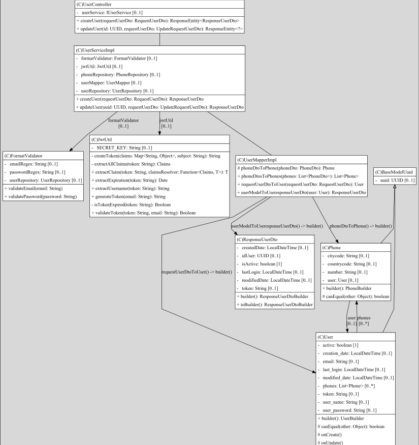

# Nisum-test
Api rest to creates and update user for a selection process for Java developer in Nisum Company

### Features

* Users create and update interface
* JWT token generation
* Swagger Documentation
* Unit test

# Getting Started

### Technical implementation requirement and usage

* Java 8
* Spring boot 2.5.6
* Maven 3.9.3

### Solution Diagram
The following image contains the structure diagram:

### Data base and Swagger
The following guides illustrate how to use features concretely:

* Run the project locally with default profile. Default port 8080
* URL for swagger: http://localhost:8080/swagger-ui/ to documentation
* Import postman collection "nisumtest.postman_collection.json" available in resources path of repository
* This Project uses H2 memory database. 
* You can access database using http://localhost:8080/h2-console, the credentials are in application.properties

